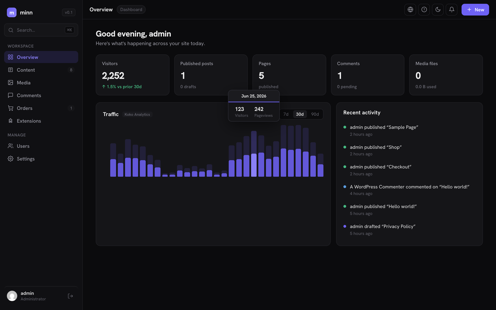

# Minn Admin

**A reimagined WordPress admin experience. Fast, focused and beautiful.**

Minn Admin serves a modern, minimal dashboard at `/minn-admin/` on your WordPress site. It's a
single-page app built on the WordPress REST API with no React, no build step, and one
vanilla-JS file. It lives *alongside* the classic wp-admin, which stays fully available.

[](https://playground.wordpress.net/#%7B%22%24schema%22%3A%22https%3A%2F%2Fplayground.wordpress.net%2Fblueprint-schema.json%22%2C%22landingPage%22%3A%22%2Fminn-admin%2F%22%2C%22meta%22%3A%7B%22title%22%3A%22Minn%20Admin%22%2C%22author%22%3A%22Austin%20Ginder%22%2C%22description%22%3A%22Launch%20Minn%20Admin%20from%20GitHub%20in%20WordPress%20Playground.%22%7D%2C%22preferredVersions%22%3A%7B%22php%22%3A%228.3%22%2C%22wp%22%3A%22latest%22%7D%2C%22features%22%3A%7B%22networking%22%3Atrue%7D%2C%22steps%22%3A%5B%7B%22step%22%3A%22login%22%7D%2C%7B%22step%22%3A%22setSiteOptions%22%2C%22options%22%3A%7B%22blogname%22%3A%22Minn%20Admin%20Playground%22%2C%22blogdescription%22%3A%22Fast%2C%20focused%20and%20beautiful%20WordPress%20admin.%22%2C%22permalink_structure%22%3A%22%2F%25postname%25%2F%22%2C%22timezone_string%22%3A%22America%2FChicago%22%7D%7D%2C%7B%22step%22%3A%22installPlugin%22%2C%22pluginData%22%3A%7B%22resource%22%3A%22url%22%2C%22url%22%3A%22https%3A%2F%2Fgithub.com%2Faustinginder%2Fminn-admin%2Freleases%2Flatest%2Fdownload%2Fminn-admin.zip%22%7D%2C%22options%22%3A%7B%22activate%22%3Atrue%2C%22targetFolderName%22%3A%22minn-admin%22%7D%2C%22ifAlreadyInstalled%22%3A%22overwrite%22%7D%2C%7B%22step%22%3A%22installPlugin%22%2C%22pluginData%22%3A%7B%22resource%22%3A%22wordpress.org%2Fplugins%22%2C%22slug%22%3A%22koko-analytics%22%7D%2C%22options%22%3A%7B%22activate%22%3Atrue%7D%7D%2C%7B%22step%22%3A%22installPlugin%22%2C%22pluginData%22%3A%7B%22resource%22%3A%22wordpress.org%2Fplugins%22%2C%22slug%22%3A%22simple-history%22%7D%2C%22options%22%3A%7B%22activate%22%3Atrue%7D%7D%2C%7B%22step%22%3A%22installPlugin%22%2C%22pluginData%22%3A%7B%22resource%22%3A%22wordpress.org%2Fplugins%22%2C%22slug%22%3A%22redirection%22%7D%2C%22options%22%3A%7B%22activate%22%3Atrue%7D%7D%2C%7B%22step%22%3A%22installPlugin%22%2C%22pluginData%22%3A%7B%22resource%22%3A%22wordpress.org%2Fplugins%22%2C%22slug%22%3A%22code-snippets%22%7D%2C%22options%22%3A%7B%22activate%22%3Atrue%7D%7D%2C%7B%22step%22%3A%22installPlugin%22%2C%22pluginData%22%3A%7B%22resource%22%3A%22wordpress.org%2Fplugins%22%2C%22slug%22%3A%22user-switching%22%7D%2C%22options%22%3A%7B%22activate%22%3Atrue%7D%7D%2C%7B%22step%22%3A%22rm%22%2C%22path%22%3A%22%2Fwordpress%2Fwp-content%2Fplugins%2Fhello.php%22%7D%2C%7B%22step%22%3A%22mkdir%22%2C%22path%22%3A%22%2Fwordpress%2Fwp-content%2Fplugins%2Fminn-example-adapter%22%7D%2C%7B%22step%22%3A%22writeFile%22%2C%22path%22%3A%22%2Fwordpress%2Fwp-content%2Fplugins%2Fminn-example-adapter%2Fminn-example-adapter.php%22%2C%22data%22%3A%7B%22resource%22%3A%22url%22%2C%22url%22%3A%22https%3A%2F%2Fraw.githubusercontent.com%2Faustinginder%2Fminn-admin%2Fmain%2Fdocs%2Fexamples%2Fminn-example-adapter%2Fminn-example-adapter.php%22%7D%7D%2C%7B%22step%22%3A%22writeFile%22%2C%22path%22%3A%22%2Fwordpress%2Fwp-content%2Fplugins%2Fminn-example-adapter%2Funinstall.php%22%2C%22data%22%3A%7B%22resource%22%3A%22url%22%2C%22url%22%3A%22https%3A%2F%2Fraw.githubusercontent.com%2Faustinginder%2Fminn-admin%2Fmain%2Fdocs%2Fexamples%2Fminn-example-adapter%2Funinstall.php%22%7D%7D%2C%7B%22step%22%3A%22wp-cli%22%2C%22command%22%3A%22wp%20plugin%20activate%20minn-example-adapter%20--user%3Dadmin%22%7D%2C%7B%22step%22%3A%22wp-cli%22%2C%22command%22%3A%22wp%20post%20create%20--post_type%3Dpage%20--post_title%3D'About%20Minn%20Admin'%20--post_status%3Dpublish%20--post_content%3D'A%20reimagined%20WordPress%20admin%20experience.'%20--user%3Dadmin%22%7D%2C%7B%22step%22%3A%22wp-cli%22%2C%22command%22%3A%22wp%20post%20create%20--post_title%3D'Meet%20the%20new%20dashboard'%20--post_status%3Dpublish%20--post_content%3D'Fast%2C%20focused%20and%20beautiful.'%20--user%3Dadmin%22%7D%2C%7B%22step%22%3A%22wp-cli%22%2C%22command%22%3A%22wp%20post%20create%20--post_title%3D'One%20vanilla-JS%20file'%20--post_status%3Dpublish%20--post_content%3D'No%20React%2C%20no%20build%20step.'%20--user%3Dadmin%22%7D%2C%7B%22step%22%3A%22wp-cli%22%2C%22command%22%3A%22wp%20post%20create%20--post_title%3D'Draft%20release%20notes'%20--post_status%3Ddraft%20--post_content%3D'Coming%20soon.'%20--user%3Dadmin%22%7D%2C%7B%22step%22%3A%22wp-cli%22%2C%22command%22%3A%22wp%20user%20create%20dana%20dana%40example.com%20--role%3Deditor%20--display_name%3D'Dana%20Lee'%20--user_pass%3Ddemo-pass-1%20--user%3Dadmin%22%7D%2C%7B%22step%22%3A%22wp-cli%22%2C%22command%22%3A%22wp%20user%20create%20sam%20sam%40example.com%20--role%3Dauthor%20--display_name%3D'Sam%20Rivera'%20--user_pass%3Ddemo-pass-2%20--user%3Dadmin%22%7D%2C%7B%22step%22%3A%22wp-cli%22%2C%22command%22%3A%22wp%20comment%20create%20--comment_post_ID%3D1%20--comment_author%3D'Dana%20Lee'%20--comment_content%3D'Love%20the%20new%20dashboard!'%20--comment_approved%3D0%20--user%3Dadmin%22%7D%2C%7B%22step%22%3A%22runPHP%22%2C%22code%22%3A%22%3C%3Fphp%20require%20'%2Fwordpress%2Fwp-load.php'%3B%20do_action(%20'koko_analytics_prune_data'%20)%3B%20global%20%24wpdb%3B%20%24p%20%3D%20%24wpdb-%3Eprefix%3B%20if%20(%20%24wpdb-%3Eget_var(%20%5C%22SHOW%20TABLES%20LIKE%20'%7B%24p%7Dkoko_analytics_site_stats'%5C%22%20)%20)%20%7B%20mt_srand(%207%20)%3B%20%24paths%20%3D%20array(%20'%2F'%2C%20'%2Fmeet-the-new-dashboard%2F'%2C%20'%2Fone-vanilla-js-file%2F'%2C%20'%2Fabout-minn-admin%2F'%20)%3B%20%24path_ids%20%3D%20array()%3B%20foreach%20(%20%24paths%20as%20%24pa%20)%20%7B%20%24wpdb-%3Equery(%20%24wpdb-%3Eprepare(%20%5C%22INSERT%20IGNORE%20INTO%20%7B%24p%7Dkoko_analytics_paths%20(path)%20VALUES%20(%25s)%5C%22%2C%20%24pa%20)%20)%3B%20%24path_ids%5B%20%24pa%20%5D%20%3D%20(int)%20%24wpdb-%3Eget_var(%20%24wpdb-%3Eprepare(%20%5C%22SELECT%20id%20FROM%20%7B%24p%7Dkoko_analytics_paths%20WHERE%20path%20%3D%20%25s%5C%22%2C%20%24pa%20)%20)%3B%20%7D%20%24refs%20%3D%20array(%20'https%3A%2F%2Fnews.ycombinator.com%2F'%2C%20'https%3A%2F%2Fwww.google.com%2F'%2C%20'https%3A%2F%2Fgithub.com%2F'%2C%20'https%3A%2F%2Fx.com%2F'%2C%20'https%3A%2F%2Fwordpress.org%2F'%20)%3B%20%24ref_ids%20%3D%20array()%3B%20foreach%20(%20%24refs%20as%20%24r%20)%20%7B%20%24wpdb-%3Equery(%20%24wpdb-%3Eprepare(%20%5C%22INSERT%20IGNORE%20INTO%20%7B%24p%7Dkoko_analytics_referrer_urls%20(url)%20VALUES%20(%25s)%5C%22%2C%20%24r%20)%20)%3B%20%24ref_ids%5B%5D%20%3D%20(int)%20%24wpdb-%3Eget_var(%20%24wpdb-%3Eprepare(%20%5C%22SELECT%20id%20FROM%20%7B%24p%7Dkoko_analytics_referrer_urls%20WHERE%20url%20%3D%20%25s%5C%22%2C%20%24r%20)%20)%3B%20%7D%20%24post_map%20%3D%20array()%3B%20foreach%20(%20array(%20'meet-the-new-dashboard'%2C%20'one-vanilla-js-file'%2C%20'about-minn-admin'%20)%20as%20%24slug%20)%20%7B%20%24po%20%3D%20get_page_by_path(%20%24slug%2C%20OBJECT%2C%20array(%20'post'%2C%20'page'%20)%20)%3B%20%24post_map%5B%20'%2F'%20.%20%24slug%20.%20'%2F'%20%5D%20%3D%20%24po%20%3F%20(int)%20%24po-%3EID%20%3A%200%3B%20%7D%20for%20(%20%24i%20%3D%2064%3B%20%24i%20%3E%3D%200%3B%20%24i--%20)%20%7B%20%24d%20%3D%20wp_date(%20'Y-m-d'%2C%20time()%20-%20%24i%20*%20DAY_IN_SECONDS%20)%3B%20%24wave%20%3D%201%20%2B%200.35%20*%20sin(%20%24i%20%2F%203.1%20)%3B%20%24v%20%3D%20(int)%20round(%20(%20210%20%2B%20mt_rand(%200%2C%20130%20)%20)%20*%20%24wave%20)%3B%20%24pv%20%3D%20(int)%20round(%20%24v%20*%20(%201.9%20%2B%20mt_rand(%200%2C%2040%20)%20%2F%20100%20)%20)%3B%20%24wpdb-%3Equery(%20%24wpdb-%3Eprepare(%20%5C%22REPLACE%20INTO%20%7B%24p%7Dkoko_analytics_site_stats%20(date%2C%20visitors%2C%20pageviews)%20VALUES%20(%25s%2C%25d%2C%25d)%5C%22%2C%20%24d%2C%20%24v%2C%20%24pv%20)%20)%3B%20%24split%20%3D%20array(%200.42%2C%200.27%2C%200.19%2C%200.12%20)%3B%20%24j%20%3D%200%3B%20foreach%20(%20%24paths%20as%20%24pa%20)%20%7B%20%24vv%20%3D%20max(%201%2C%20(int)%20round(%20%24v%20*%20%24split%5B%20%24j%20%5D%20)%20)%3B%20%24wpdb-%3Equery(%20%24wpdb-%3Eprepare(%20%5C%22REPLACE%20INTO%20%7B%24p%7Dkoko_analytics_post_stats%20(date%2C%20post_id%2C%20visitors%2C%20pageviews%2C%20path_id)%20VALUES%20(%25s%2C%25d%2C%25d%2C%25d%2C%25d)%5C%22%2C%20%24d%2C%20isset(%20%24post_map%5B%20%24pa%20%5D%20)%20%3F%20%24post_map%5B%20%24pa%20%5D%20%3A%200%2C%20%24vv%2C%20(int)%20round(%20%24vv%20*%201.6%20)%2C%20%24path_ids%5B%20%24pa%20%5D%20)%20)%3B%20%24j%2B%2B%3B%20%7D%20foreach%20(%20%24ref_ids%20as%20%24k%20%3D%3E%20%24rid%20)%20%7B%20%24rv%20%3D%20max(%201%2C%20(int)%20round(%20%24v%20*%20(%200.16%20-%20%24k%20*%200.025%20)%20)%20)%3B%20%24wpdb-%3Equery(%20%24wpdb-%3Eprepare(%20%5C%22REPLACE%20INTO%20%7B%24p%7Dkoko_analytics_referrer_stats%20(date%2C%20id%2C%20unique_hits%2C%20hits)%20VALUES%20(%25s%2C%25d%2C%25d%2C%25d)%5C%22%2C%20%24d%2C%20%24rid%2C%20%24rv%2C%20(int)%20round(%20%24rv%20*%201.3%20)%20)%20)%3B%20%7D%20%7D%20%7D%20if%20(%20function_exists(%20'Code_Snippets%5C%5C%5C%5Csave_snippet'%20)%20)%20%7B%20%24mk%20%3D%20function%20(%20%24name%2C%20%24desc%2C%20%24code%2C%20%24active%20)%20%7B%20%24s%20%3D%20new%20%5C%5CCode_Snippets%5C%5CSnippet()%3B%20%24s-%3Ename%20%3D%20%24name%3B%20%24s-%3Edesc%20%3D%20%24desc%3B%20%24s-%3Ecode%20%3D%20%24code%3B%20%24s-%3Escope%20%3D%20'global'%3B%20%24s-%3Eactive%20%3D%20%24active%3B%20%5C%5CCode_Snippets%5C%5Csave_snippet(%20%24s%20)%3B%20%7D%3B%20%24mk(%20'Add%20footer%20credit'%2C%20'Prints%20a%20small%20HTML%20comment%20in%20the%20footer.'%2C%20%5C%22add_action(%20'wp_footer'%2C%20function%20()%20%7B%5C%5Cn%5C%5Ctecho%20'%3C!--%20Crafted%20with%20Minn%20Admin%20--%3E'%3B%5C%5Cn%7D%20)%3B%5C%22%2C%20true%20)%3B%20%24mk(%20'Disable%20emoji%20scripts'%2C%20'Removes%20the%20emoji%20detection%20script%20and%20styles.'%2C%20%5C%22remove_action(%20'wp_head'%2C%20'print_emoji_detection_script'%2C%207%20)%3B%5C%5Cnremove_action(%20'wp_print_styles'%2C%20'print_emoji_styles'%20)%3B%5C%22%2C%20true%20)%3B%20%24mk(%20'Trim%20dashboard%20widgets%20(draft)'%2C%20'Example%20snippet%20left%20inactive%20on%20purpose.'%2C%20%5C%22add_action(%20'wp_dashboard_setup'%2C%20function%20()%20%7B%5C%5Cn%5C%5Ctremove_meta_box(%20'dashboard_primary'%2C%20'dashboard'%2C%20'side'%20)%3B%5C%5Cn%7D%20)%3B%5C%22%2C%20false%20)%3B%20%7D%22%7D%5D%7D)%3B%20global%20%24wpdb%3B%20%24p%20%3D%20%24wpdb-%3Eprefix%3B%20if%20(%20%24wpdb-%3Eget_var(%20%5C%22SHOW%20TABLES%20LIKE%20'%7B%24p%7Dkoko_analytics_site_stats'%5C%22%20)%20)%20%7B%20mt_srand(%207%20)%3B%20%24paths%20%3D%20array(%20'%2F'%2C%20'%2Fmeet-the-new-dashboard%2F'%2C%20'%2Fone-vanilla-js-file%2F'%2C%20'%2Fabout-minn-admin%2F'%20)%3B%20%24path_ids%20%3D%20array()%3B%20foreach%20(%20%24paths%20as%20%24pa%20)%20%7B%20%24wpdb-%3Equery(%20%24wpdb-%3Eprepare(%20%5C%22INSERT%20IGNORE%20INTO%20%7B%24p%7Dkoko_analytics_paths%20(path)%20VALUES%20(%25s)%5C%22%2C%20%24pa%20)%20)%3B%20%24path_ids%5B%20%24pa%20%5D%20%3D%20(int)%20%24wpdb-%3Eget_var(%20%24wpdb-%3Eprepare(%20%5C%22SELECT%20id%20FROM%20%7B%24p%7Dkoko_analytics_paths%20WHERE%20path%20%3D%20%25s%5C%22%2C%20%24pa%20)%20)%3B%20%7D%20%24refs%20%3D%20array(%20'https%3A%2F%2Fnews.ycombinator.com%2F'%2C%20'https%3A%2F%2Fwww.google.com%2F'%2C%20'https%3A%2F%2Fgithub.com%2F'%2C%20'https%3A%2F%2Fx.com%2F'%2C%20'https%3A%2F%2Fwordpress.org%2F'%20)%3B%20%24ref_ids%20%3D%20array()%3B%20foreach%20(%20%24refs%20as%20%24r%20)%20%7B%20%24wpdb-%3Equery(%20%24wpdb-%3Eprepare(%20%5C%22INSERT%20IGNORE%20INTO%20%7B%24p%7Dkoko_analytics_referrer_urls%20(url)%20VALUES%20(%25s)%5C%22%2C%20%24r%20)%20)%3B%20%24ref_ids%5B%5D%20%3D%20(int)%20%24wpdb-%3Eget_var(%20%24wpdb-%3Eprepare(%20%5C%22SELECT%20id%20FROM%20%7B%24p%7Dkoko_analytics_referrer_urls%20WHERE%20url%20%3D%20%25s%5C%22%2C%20%24r%20)%20)%3B%20%7D%20%24post_map%20%3D%20array()%3B%20foreach%20(%20array(%20'meet-the-new-dashboard'%2C%20'one-vanilla-js-file'%2C%20'about-minn-admin'%20)%20as%20%24slug%20)%20%7B%20%24po%20%3D%20get_page_by_path(%20%24slug%2C%20OBJECT%2C%20array(%20'post'%2C%20'page'%20)%20)%3B%20%24post_map%5B%20'%2F'%20.%20%24slug%20.%20'%2F'%20%5D%20%3D%20%24po%20%3F%20(int)%20%24po-%3EID%20%3A%200%3B%20%7D%20for%20(%20%24i%20%3D%2064%3B%20%24i%20%3E%3D%200%3B%20%24i--%20)%20%7B%20%24d%20%3D%20wp_date(%20'Y-m-d'%2C%20time()%20-%20%24i%20*%20DAY_IN_SECONDS%20)%3B%20%24wave%20%3D%201%20%2B%200.35%20*%20sin(%20%24i%20%2F%203.1%20)%3B%20%24v%20%3D%20(int)%20round(%20(%20210%20%2B%20mt_rand(%200%2C%20130%20)%20)%20*%20%24wave%20)%3B%20%24pv%20%3D%20(int)%20round(%20%24v%20*%20(%201.9%20%2B%20mt_rand(%200%2C%2040%20)%20%2F%20100%20)%20)%3B%20%24wpdb-%3Equery(%20%24wpdb-%3Eprepare(%20%5C%22REPLACE%20INTO%20%7B%24p%7Dkoko_analytics_site_stats%20(date%2C%20visitors%2C%20pageviews)%20VALUES%20(%25s%2C%25d%2C%25d)%5C%22%2C%20%24d%2C%20%24v%2C%20%24pv%20)%20)%3B%20%24split%20%3D%20array(%200.42%2C%200.27%2C%200.19%2C%200.12%20)%3B%20%24j%20%3D%200%3B%20foreach%20(%20%24paths%20as%20%24pa%20)%20%7B%20%24vv%20%3D%20max(%201%2C%20(int)%20round(%20%24v%20*%20%24split%5B%20%24j%20%5D%20)%20)%3B%20%24wpdb-%3Equery(%20%24wpdb-%3Eprepare(%20%5C%22REPLACE%20INTO%20%7B%24p%7Dkoko_analytics_post_stats%20(date%2C%20post_id%2C%20visitors%2C%20pageviews%2C%20path_id)%20VALUES%20(%25s%2C%25d%2C%25d%2C%25d%2C%25d)%5C%22%2C%20%24d%2C%20isset(%20%24post_map%5B%20%24pa%20%5D%20)%20%3F%20%24post_map%5B%20%24pa%20%5D%20%3A%200%2C%20%24vv%2C%20(int)%20round(%20%24vv%20*%201.6%20)%2C%20%24path_ids%5B%20%24pa%20%5D%20)%20)%3B%20%24j%2B%2B%3B%20%7D%20foreach%20(%20%24ref_ids%20as%20%24k%20%3D%3E%20%24rid%20)%20%7B%20%24rv%20%3D%20max(%201%2C%20(int)%20round(%20%24v%20*%20(%200.16%20-%20%24k%20*%200.025%20)%20)%20)%3B%20%24wpdb-%3Equery(%20%24wpdb-%3Eprepare(%20%5C%22REPLACE%20INTO%20%7B%24p%7Dkoko_analytics_referrer_stats%20(date%2C%20id%2C%20unique_hits%2C%20hits)%20VALUES%20(%25s%2C%25d%2C%25d%2C%25d)%5C%22%2C%20%24d%2C%20%24rid%2C%20%24rv%2C%20(int)%20round(%20%24rv%20*%201.3%20)%20)%20)%3B%20%7D%20%7D%20%7D%20if%20(%20function_exists(%20'Code_Snippets%5C%5C%5C%5Csave_snippet'%20)%20)%20%7B%20%24mk%20%3D%20function%20(%20%24name%2C%20%24desc%2C%20%24code%2C%20%24active%20)%20%7B%20%24s%20%3D%20new%20%5C%5CCode_Snippets%5C%5CSnippet()%3B%20%24s-%3Ename%20%3D%20%24name%3B%20%24s-%3Edesc%20%3D%20%24desc%3B%20%24s-%3Ecode%20%3D%20%24code%3B%20%24s-%3Escope%20%3D%20'global'%3B%20%24s-%3Eactive%20%3D%20%24active%3B%20%5C%5CCode_Snippets%5C%5Csave_snippet(%20%24s%20)%3B%20%7D%3B%20%24mk(%20'Add%20footer%20credit'%2C%20'Prints%20a%20small%20HTML%20comment%20in%20the%20footer.'%2C%20%5C%22add_action(%20'wp_footer'%2C%20function%20()%20%7B%5C%5Cn%5C%5Ctecho%20'%3C!--%20Crafted%20with%20Minn%20Admin%20--%3E'%3B%5C%5Cn%7D%20)%3B%5C%22%2C%20true%20)%3B%20%24mk(%20'Disable%20emoji%20scripts'%2C%20'Removes%20the%20emoji%20detection%20script%20and%20styles.'%2C%20%5C%22remove_action(%20'wp_head'%2C%20'print_emoji_detection_script'%2C%207%20)%3B%5C%5Cnremove_action(%20'wp_print_styles'%2C%20'print_emoji_styles'%20)%3B%5C%22%2C%20true%20)%3B%20%24mk(%20'Trim%20dashboard%20widgets%20(draft)'%2C%20'Example%20snippet%20left%20inactive%20on%20purpose.'%2C%20%5C%22add_action(%20'wp_dashboard_setup'%2C%20function%20()%20%7B%5C%5Cn%5C%5Ctremove_meta_box(%20'dashboard_primary'%2C%20'dashboard'%2C%20'side'%20)%3B%5C%5Cn%7D%20)%3B%5C%22%2C%20false%20)%3B%20%7D%22%7D%5D%7D)

<!--
  The badge/launch link above is the URL-encoded contents of
  .wp-playground/blueprint.json (inlined because Playground intermittently fails to fetch
  a remote blueprint-url). blueprint.json is the source of truth; after editing it, regenerate
  the fragment and paste it after `https://playground.wordpress.net/#` in both readmes:

    node -e 'const b=require("fs").readFileSync(".wp-playground/blueprint.json","utf8");console.log("https://playground.wordpress.net/#"+encodeURIComponent(JSON.stringify(JSON.parse(b))))'
-->

## Features

- **Overview** — stat cards, a real **Traffic chart** with hover details when an analytics plugin
  is installed (Koko Analytics, WP Statistics, Burst, Independent Analytics, AnalyticsWP, or
  Google Analytics through **Site Kit**), **click a bar for that day's top pages and referrers**
  (Koko, WP Statistics, Burst and Independent Analytics today; others join via
  `minn_admin_traffic_day`), and a recent-activity feed
- **Content** — posts, pages and custom post types sorted by publish date (scheduled posts
  lead with their go-out dates), with search, category/tag filters, status pills (live posts
  carrying unsaved edits wear a **Modified** chip, with a matching filter; a post someone
  else has open says who is editing), **bulk
  actions** (set status or trash, with shift-click range select), and **row actions**:
  right-click or hover for quick publish/draft/trash, view, and a block-editor escape
- **Media** — grid/list library, uploads, drag-and-drop, a preview overlay with arrow-key
  navigation and in-place **title, alt text, caption & description editing**, **bulk select
  and delete** (shift-range, on the grid and the list), a right-click menu, and a built-in
  **image editor** (rotate and crop, saved as a new copy). **Folders** arrive from your folder
  plugin (FileBird, Real Media Library or Folders by Premio) with a **Move to folder** bulk
  action through each plugin's own machinery; an **Unattached** filter and a **month picker**
  cover the daily cleanup questions; every file's detail names the post it is **attached to**,
  one click from that post's editor; **Replace file** works in place through Enable Media
  Replace; the **SVG** filter tab appears with Safe SVG or SVG Support active, and
  **↻ Thumbnails** works through Regenerate Thumbnails or Force Regenerate Thumbnails
- **Comments** — full moderation (pending / approved / spam / trash) with **bulk moderation**
  (each tab offers its own verbs), inline replies, in-place comment editing, **Block
  commenter** (core's disallowed list, with Undo) and a right-click menu for the same verbs
- **Ecommerce** — full WooCommerce day-to-day in Minn: **Orders** open as full pages (linkable,
  refreshable, with a **Quick view** modal from the list) with search, status, notes, a **Payment
  card** that records hand-received payments through WooCommerce's own machinery, **itemized
  refunds** with quantity steppers and restocking, resend/custom email, pay URL, **New order**,
  **Analytics** with long-range revenue and top products, and a Store strip on the Overview naming
  the orders that need work today,
  **Products** (stock filters, bulk, daily fields, **Add product**), **Coupons**, **Customers**, and
  **Subscriptions** when WooCommerce Subscriptions is active (status, next payment, parent order,
  related orders, customer strip). Orders, products and customers carry **right-click menus** for
  the common moves (status changes, stock and publish toggles, email, jump to a customer's orders).
  Invoice / packing-slip downloads when PDF Invoices & Packing Slips is active. Product, coupon and
  subscription CPTs are fenced out of Content.
- **Users** — directory with search, a role filter, create/edit users, roles, passwords,
  **bulk role change**, **per-user login sessions with one-click sign-out**, **Switch to
  this user** when the User Switching plugin is active (a switched session shows a **Switch
  back** bar in Minn), and **Copy one-time login link** when One Time Login is active
- **Your profile** — a full page at `/minn-admin/profile`: account, public profile (first/last
  name, website, bio, Gravatar), **per-user language** with automatic pack installs, the
  front-end toolbar preference, appearance, hidden integrations, and login sessions
- **AI Access** — generate revocable **application passwords** for AI agents plus a site-tailored
  **agent guide** (markdown REST reference) to hand to a coding agent; configuration work stays
  out of Minn by design
- **Extensions** — install plugins and themes from WordPress.org or zip upload (Add plugin opens a
  **catalog by category** with install tips, not only free-text search), activate, deactivate,
  delete, per-item and bulk updates with **Queued… / Updating…** feedback that survives worker
  recycles, a Themes tab with screenshots, cards wearing real wp.org icons (linked to the
  directory) with linked author lines, **right-click menus** on plugin and theme cards
  (Activate, Update, Delete, Open on WordPress.org or GitHub, Copy file), and a **Licenses** tab
  (below)
- **Structure** — post types, taxonomies and terms on one page. See every registered post type
  and taxonomy and manage definitions through whoever owns them (ACF, Custom Post Type UI, or
  Minn's own store when neither is active; code-registered ones shown read-only), and a full
  **terms manager**: rename, re-parent, **merge** (posts move to the survivor through core's own
  reassignment) and delete across every taxonomy, with an indented tree for hierarchical ones
- **Settings** — reorganized by intent: **Site** (identity, logo, site language, locale, admin, with timezone picker),
  **Visibility** (search engines, maintenance mode, membership), **Homepage**, **Content**
  (new-content defaults + permalinks with automatic rewrite flushing), **Comments** (discussion +
  spam), **Design** (the Customizer's Additional CSS, validated before saving) and
  **Connectors** (WP 7.0's registry of AI providers and external services: connection state,
  where each key comes from (saved, wp-config constant or environment variable), install the
  companion plugin in place, keys saved through core's own masked route), under a sticky
  section nav. The **Spam** page shows who filters comment spam (Akismet, Antispam Bee,
  CleanTalk, WP Armour) with safe toggles and blocked counts. **Site-visibility warnings**: an
  Overview banner and a persistent topbar chip appear whenever a maintenance plugin, password
  gate or "discourage search engines" is hiding the site, with inline fix controls where Minn
  can safely flip the setting (third parties register via `minn_admin_visibility_providers`)
- **Editor** — a calm, block-aware writing surface that stores **native Gutenberg markup**
  (zero lock-in: open any post in the block editor, any time). Markdown typing conventions
  (`**bold**`, `` `code` ``, `## headings`, lists, quotes, fences, dividers…), with wraps
  that stay on the undo stack (including inline code). Link popover on ⌘K, text alignment,
  table and image controls in island-style cutouts, complex blocks preserved byte-for-byte
  as **configurable islands** with real front-end styles (full height; previews no longer
  clip tall grids). Slash commands stay curated and type-to-filter; **Browse all** or **⌘/**
  opens the **block picker**, grouped by source (basics, plugin blocks, design libraries,
  patterns). Plugins can register free-form slash items through
  **`minn_admin_editor_commands`** (boilerplate HTML, island templates, or an async REST
  route). **Dynamic third-party blocks** that render standalone auto-appear in search (no
  adapter); **Stackable**, **Kadence**, and **GenerateBlocks** free design/pattern libraries
  insert as valid Gutenberg markup with images sideloaded; **block patterns** from core, the
  theme, and plugins join the same search. Island content is editable: **text runs** and an
  **Images** section rewrite only what you change; block settings scale (used fields first,
  the rest behind **More settings**); every island links out to the block editor for layout
  controls. Previews pick up lazy CSS and **auto-warm** browser-compiled styles when needed.
  Syntax-highlighted code blocks; **writing stats** on the sticky pill (words, reading time,
  session delta, optional word goal); scheduling and one-click publish. **Paste cleanup**
  turns Word / Google Docs / web HTML into the safe subset; **paste or drag an image**
  uploads at the caret with an inline caption. The publish sidebar edits the **slug**,
  **visibility** (a themed Public / Password / Private combobox), per-post **discussion**,
  **sticky** and **post format** (when the theme supports formats). Deleting an embed offers
  an **Undo** toast; **table** add/delete row and column undo with **⌘Z**. **Revision diffs**
  open a side-by-side, word-marked diff against the current content. An **outline panel**
  lists headings as a live table of contents; **focus mode** (⌘⇧D) fades all but the current
  paragraph; **outline mode** (⌘⇧O) leaves just the writing and the outline. The **internal
  link picker** searches your own posts from the link popover, and a themed **date-time
  picker** handles scheduling. **Find & replace** (⌘⇧F) matches across inline formatting,
  never touches protected islands, and every replace is a native undo step. Built for real
  writing sessions: **IME-safe** composition (CJK and dead keys), **mobile Safari** keyboard
  and hit-target polish, and a first-cut **accessible** toolbar, slash menu, and block
  popovers. ⌘⏎ publishes; the help dialog documents every shortcut.
  Where this is heading: [the editor roadmap](docs/editor-roadmap.md)
- **Never lose work** — post locking on WordPress's own `_edit_lock` (Minn, the classic editor
  and Gutenberg all honor each other, with takeover), plus a localStorage **crash net** that
  snapshots every edit within ~1.2s (before the first autosave) and offers recovery on the
  next open. Status-aware autosave: drafts save in place, published posts back up to revisions
  (only Update goes live), with a backup-restore banner.
- **Page builders** — build a page with **Divi, Elementor, Brizy, Beaver Builder, Etch, Bricks
  or WPBakery** and keep managing it from Minn: builder-owned pages are marked, edited through
  the builder's own chrome-free surface via **Edit in ⟨builder⟩** (no wp-admin screen), and
  fenced so a stray Minn edit can't break the builder's canvas. + New can start a page in any
  active builder. Third parties register via the `minn_admin_page_builders` filter
- **System** — a developer diagnostics page with a sticky section **jump bar**: a health strip
  over WordPress / PHP / database / server facts, plus **loopback and REST self-checks**, site
  visibility, **Wordfence firewall & scan posture**, **SSL enforcement** (Really Simple SSL),
  backups and licenses; the **autoloaded-options breakdown** and **cron health** expand into
  full-detail modals (every option by size, every scheduled event with its next run); the real
  login URL (honoring login-hiders), an **installed extensions manifest**, a **Tools card**
  linking wp-admin's one-shot jobs (Site Health, export/import, GDPR tools), live **debug
  toggles** that safely rewrite `wp-config.php`, a multi-source **log viewer** (debug log, PHP error log and every WooCommerce log channel, with a collapse-repeats mode), and one-click
  **Copy report** as markdown
- **Licenses** — a license manager on **Extensions → Licenses**, beside the plugins and themes
  it describes: every paid product classified **valid / expired / invalid / missing** from the
  vendor's own locally stored state (read-only: no network calls, no seat burn), grouped by
  state with inactive components collapsed, with **paste-to-activate, deactivate and
  re-verify** wired through each
  vendor's own code for more than twenty vendors (Elementor Pro, ACF PRO, WP Rocket, Gravity
  Forms & SMTP, Divi, Beaver Builder, Brizy, Etch, Bricks, The Events Calendar family, Kadence
  Blocks Pro, WPMU DEV, SearchWP, Gravity Perks, GP Premium, Perfmatters, WP All Import/Export,
  Slider Revolution, LayerSlider), plus generic Freemius / EDD / SureCart / StellarWP detection.
  A pasted key rides one request and is never stored or logged; failures never auto-retry;
  inactive components can be turned back on in place. Third parties register via
  `minn_admin_license_providers`
- **Editor field panels** — **ACF**, **Meta Box** and **Pods** simple fields in the sidebar
  (advanced types count as locked with a wp-admin link); **SEO panel** for Yoast SEO, Rank Math,
  All in One SEO, SEOPress or SiteSEO title, meta description and focus keyword (first active
  SEO plugin wins); **Event details** for The Events Calendar (dates, all-day, venue and
  organizer as live search pickers, cost, website); **Job listing** for WP Job Manager, drawn
  live from its own field schema; **Podcast episode** for Seriously Simple Podcasting and
  PowerPress (media file, duration, the Apple Podcasts fields). Every write goes through the
  owning plugin's own save machinery
- **Menus & Widgets** — classic nav menus with drag-to-reorder (children travel with their
  parent) and right-click menus on every item; classic sidebars with **drag grips** to reorder widgets in an area, plus move
  between areas and in-place edit for block/text/HTML widgets
- **Surfaces** — Minn's answer to plugin sprawl: one sidebar item per *job*, not per plugin,
  with every capable plugin layered in behind it and a provider switcher when more than one is
  active. **Forms** (Gravity Forms, Ninja Forms, Fluent Forms, Forminator, Formidable, Everest
  Forms, SureForms, Elementor Pro, Contact Form 7 via Flamingo or CFDB7) shows entries as
  contact cards with real field labels and ←/→ stepping, with the full **Gravity Forms
  workflow** inside Minn: star, spam, trash, restore, **bulk actions**, notes and resent
  notifications across Received / Spam / Trash views, plus a **Feeds** view listing every
  add-on integration across your forms (Everest Forms carries the same three status views
  through its own entry helpers);
  **Email** (Gravity SMTP, FluentSMTP, WP Mail SMTP, Post SMTP, WP Mail Logging, SureMails,
  Site Mailer) shows sent mail with the real HTML body in a **fully sandboxed preview**,
  resend, and search plus delete where the logger supports it, plus Gravity SMTP's **full
  settings** (all 21 connectors, drawn at runtime from its own schema), suppressions,
  **send a test email**, and a **FluentSMTP Settings view** for the day-to-day choices;
  **Activity Log** (Simple History, WP Activity Log, Aryo, Stream, All-In-One Security,
  Wordfence login security, plus **Limit Login Attempts Reloaded** and **Solid Security**
  lockouts with unlock/release actions) reads like an audit feed; **Redirects** (Redirection,
  Safe Redirect Manager, Simple 301 Redirects, 301 Redirects) lists, searches, creates and
  edits, with **sortable columns** on Redirection; **Snippets** (Code
  Snippets, WPCode, FluentSnippets, Simple Custom CSS and JS, Header Footer Code Manager) lists,
  toggles, creates and bulk-edits; **Performance** (Perfmatters, Autoptimize, Asset CleanUp,
  Performance Lab) shares one Tools item with a provider switcher; **Backups**
  (UpdraftPlus, WPvivid, BackWPup, All-in-One WP Migration, Duplicator, Disembark) below.
  **Status cards** now open the whole mail, redirects and snippets families, and detail modals
  render **typed rows**: status pills, code blocks, key-value tables and sandboxed HTML
  previews. Surface lists open a **⋯ / right-click** menu of that collection's actions. Plugins that need
  their own first-run install get a **setup card** that runs their installer in place. The sidebar
  organizes into **Workspace / Tools / Manage** groups so daily inboxes stay separate from site plumbing
- **Backups** — with **UpdraftPlus** or **WPvivid**: sets listed, status cards, a System health
  check answering "is my site backed up?", and **Back up site now** from ⌘K. With **BackWPup**:
  local folder archives and run-now. With **All-in-One WP Migration**: local `.wpress` exports
  with delete. With **Duplicator**: packages with archive sizes read from disk and delete through
  its own cleanup. With **Disembark**: a status card (last scan, database size, working files),
  the exact `disembark connect` command click-to-copy, scan sessions with cleanup, and token
  regeneration
- **Notifications that respect you** — comments, plugin/theme/core updates and new users in one
  panel, plus an **admin-notice digest**: the notices other plugins print in wp-admin are
  extracted as structured data (never their HTML or JavaScript) into a Notices tab; **Allow /
  No Thanks** and ThemeIsle-style dismiss links run in the background (not a new wp-admin tab),
  and any notice can be hidden with Undo. Each update offer has its own **Update → version**
  button; the Updates tab also pins **Update everything** (plugins, themes and core in one
  click, poll-verified core). A pending WordPress update also shows as an amber topbar chip and
  Overview banner
- **Command palette** — ⌘K / Ctrl-K everywhere, and it **finds your content**: type anything to
  see your posts, pages and CPTs (drafts and scheduled included) under the command matches, and
  Enter opens the Minn editor. Site-care actions built in: **Clear site cache** purges every
  layer the site runs (Kinsta, LiteSpeed, WP Super Cache, W3TC, WP Rocket, WP Fastest Cache,
  SiteGround, Autoptimize, WP-Optimize, Cache Enabler, Hummingbird, Elementor CSS, SpeedyCache,
  Redis Object Cache, Breeze, Nginx Helper, Cloudflare), each in its own isolated request
- **Extending** — one-filter APIs for any plugin to register views (with status cards and optional
  **charts**, extra **list views**, tabs, status filters, **sortable columns**, detail layouts
  with **typed rows** including sandboxed HTML previews, actions with inline
  fields, **bulk actions**, schema-driven **settings views** including **item-scoped settings**,
  and **setup gates**), editor panels (including async **search-picker** fields), **editor slash
  commands**, traffic data (including
  per-day drill-down), **media folder providers**, cache purgers, spam providers, license providers, visibility providers,
  design libraries, page builders or block-inspector forms; the System page's **Integrations**
  card shows everything registered and flags descriptor problems instead of failing silently.
  The full coverage map lives in [docs/plugin-support.md](docs/plugin-support.md)
- **Quiet by architecture** — integrations are data, never third-party HTML or scripts, and
  attention is budgeted: one plugin holds at most three nav slots and three default slash
  entries (overflow stays one search away), Workspace placement requires an inbox-shaped view,
  **off-site links always carry the ↗ mark**, and every surface, editor panel, design library
  and slash namespace can be **hidden per user** from Minn's own UI (restore from Your
  profile), with no API for a plugin to detect or resist it
- **Dark, light and System themes** (follows your OS until you choose; right-click for an
  explicit menu) plus **per-user color schemes**: named light/dark presets or a fully custom
  scheme with per-slot color pickers, set on Your profile. Bundled fonts, zero external
  requests from the app, responsive down to phones

## Install

1. Download or clone into `wp-content/plugins/minn-admin`.
2. Activate through the Plugins screen.
3. Visit `/minn-admin/`. It's also linked from the admin bar and the wp-admin menu.

Pretty permalinks recommended (clean routes like `/minn-admin/content`); without them the app
falls back to `/?minn_admin=1` with hash routing. Updates are delivered through the normal
WordPress updates UI via GitHub Releases.

## Extending

Any plugin can add a view to Minn with one filter: a declarative descriptor, no JavaScript
required. Start with [docs/for-plugin-authors.md](docs/for-plugin-authors.md); it opens with
a quick start and carries a screenshot of every primitive. If your data lives in a custom
table, [docs/shim-tutorial.md](docs/shim-tutorial.md) walks the whole build with a copyable
example plugin, and the WordPress Playground demo boots that example preactivated so a
working instance of the API is one click away.

## Documentation

- [Using Minn Admin](docs/user-guide.md) (the site-owner guide: getting around, writing, staying in control, safety)
- [Project goals](docs/goals.md)
- [Editor direction](docs/editor-direction.md)
- [Editor roadmap](docs/editor-roadmap.md)
- [Block inspector](docs/block-inspector.md)
- [Block-suite lab notes](docs/block-suites.md)
- [For plugin authors](docs/for-plugin-authors.md)
- [Security policy](SECURITY.md)
- [Changelog](changelog.md)

## Development

Edit and go. There's no build step. Lint with `node --check assets/js/app.js` and
`php -l minn-admin.php`. Commit messages follow [Emoji-Log](https://github.com/ahmadawais/Emoji-Log).

## License

[MIT](LICENSE) © [Austin Ginder](https://austinginder.com)
